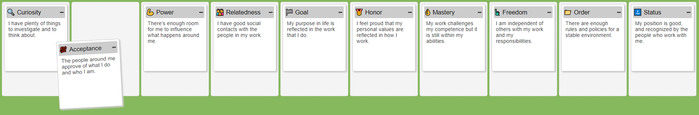

# Moving-Motivators

Moving Motivators is an exercise to help us reflect on motivation and how it affects organizational change.

---

### Screenshot

## Why?

What do you do when you need to make a decision? How do you know what makes your new hire tick? How do you know what gets under your skin?

One of the easiest and fun ways to delve into your intrinsic motivations is to play Moving Motivators! I use the cards personally, and also I use them in each talk with employees, feedback talks, and applicants. I often work remotely, and playing paper cards is not the right choice. So I created this simple version for usage inside the browser - and it works, since tons of talks.

The cards are a helping tool from the [management 3.0](https://management30.com/) idea. Management 3.0 is an ever-changing collection of games, tools, and practices to help any worker manage the organization. It is a way of looking at work systems.

## Online Usage, Demo
My webspace [bueltge.de/moving-motivators/](https://bueltge.de/moving-motivators/)
Via GitHub Deploy [bueltge.github.io/Moving-Motivators/](https://bueltge.github.io/Moving-Motivators/)

## License

Copyright (c) 2019 until now, [Frank Bültge](https://bueltge.de)

## Contributing

All feedback/bug reports/pull requests are welcome.

---
